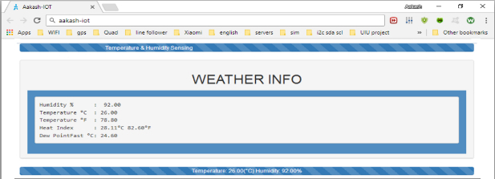

# IoT Weather Station

IoT Weather Station with web interface for monitoring temperature and humidity.

## Web Interface

### Features
- Displays real-time temperature and humidity data
- Responsive design using Bootstrap for easy viewing on different devices

## Components
- ESP8266 NodeMCU
- DHT22 Temperature and Humidity Sensor

## Technologies
- C++ (Arduino)
- HTML
- CSS
- Bootstrap
- Javascript

### How It Works
The IoT Weather Station uses an ESP8266 NodeMCU microcontroller to read data from the DHT22 sensor, which measures temperature and humidity. The microcontroller hosts a web server that serves a simple web page displaying the current readings. Users can access this page from any device connected to the same network, making it convenient for monitoring environmental conditions remotely.

### Why It's Necessary
This project provides a straightforward solution for monitoring weather conditions in real-time. It's essential for applications where environmental data needs to be monitored remotely, such as in home automation, agriculture, or research projects.

### Usage
1. **Hardware Setup**: Connect the DHT22 sensor to the ESP8266 NodeMCU board.
2. **Upload Code**: Upload the provided Arduino sketch to the NodeMCU using the Arduino IDE.
3. **Access Web Interface**: Once connected to your WiFi network, open a web browser and enter the IP address assigned to the NodeMCU. You will see the current temperature and humidity readings displayed.

### Future Enhancements
- Add more sensors for comprehensive environmental monitoring (e.g., air quality, light intensity).
- Implement data logging and visualization for historical data analysis.
- Integrate with cloud services for remote data storage and analysis.

### Credits
Developed by Atiqur Rahman Aakash  
Email: aakash.unipune@gmail.com
